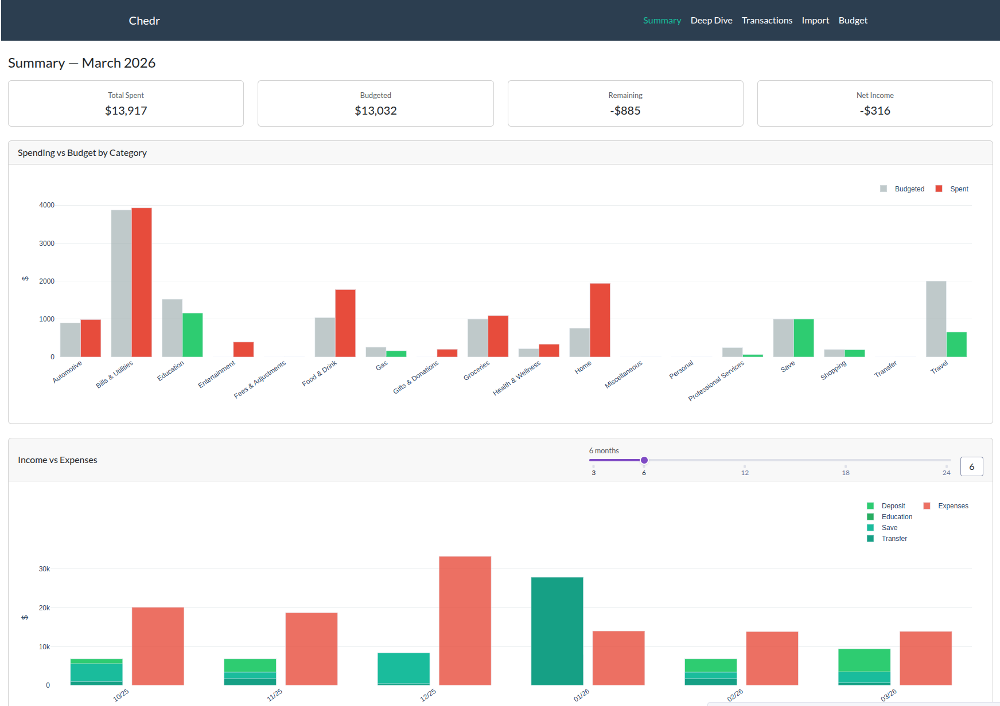
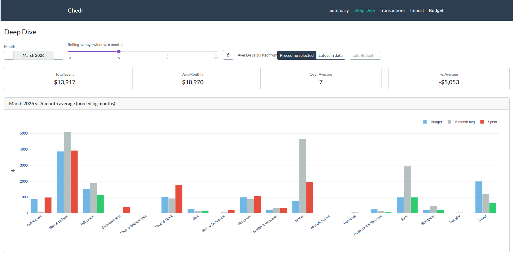
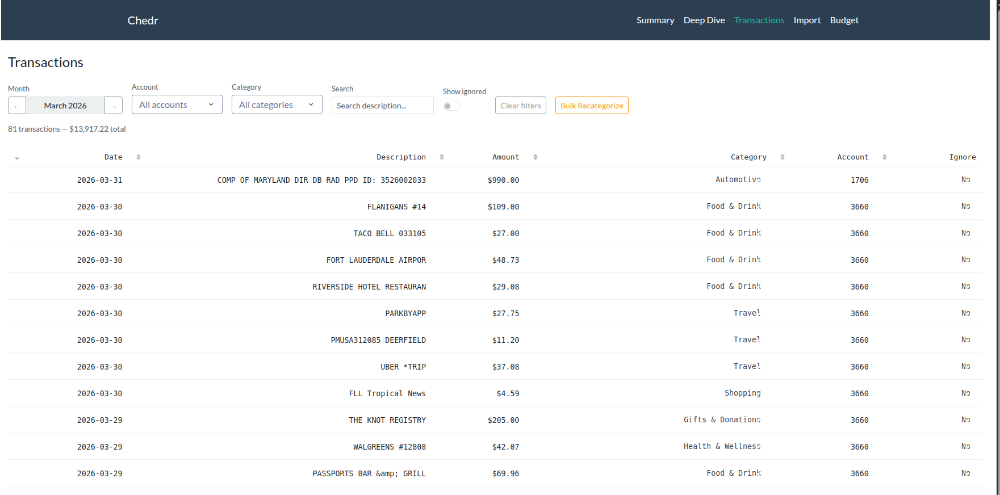
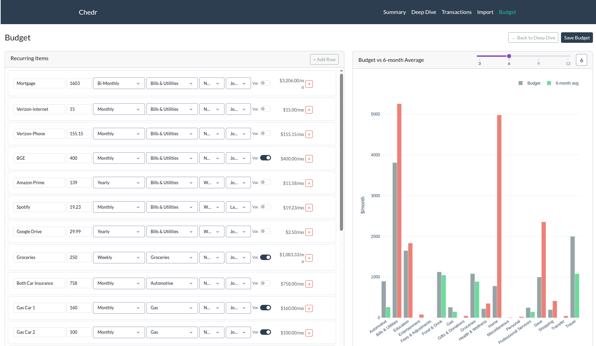
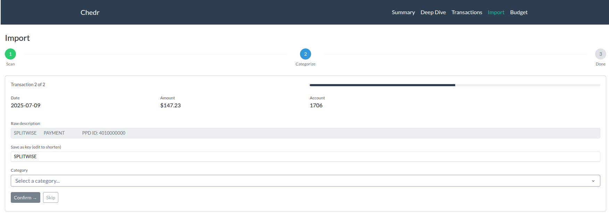

# Chedr

A personal finance tracking application built with Python and Dash. Chedr ingests transaction CSVs from multiple bank accounts, categorizes spending automatically, and visualizes monthly expenses against your budget and historical averages.

Developed with help from Claude...I'm not a front-end guy.

---

## Screenshots

### Summary Page

*Monthly spending vs budget by category, with income vs expenses trend chart*

### Deep Dive Page

*Category-level spending compared to rolling average and budget, with month navigation*

### Transactions Page

*Filterable transaction table with inline re-categorization and bulk recategorize tool*

### Budget Page

*Live budget editor with real-time comparison against rolling average spend*

### Import Page

*Step-by-step ingestion flow with manual categorization for unrecognized transactions*

---

## Features

- **Multi-account ingestion** — drop CSVs from multiple banks into a single directory and Chedr picks up new files automatically on each import
- **Automatic categorization** — transactions are matched against a substring key file and assigned categories without manual input
- **Manual categorization UI** — unrecognized transactions are surfaced one at a time in a step-through interface, with the option to save the matched substring for future imports
- **Budget tracking** — compare monthly spending against a per-category budget with color-coded over/under indicators
- **Rolling average deep dive** — inspect any month's spending against a configurable rolling average window (3–12 months), with a toggle between "preceding selected month" and "latest in data" modes
- **Income vs expenses trend** — a sliding window chart (3–24 months) shows stacked income by category alongside total expenses
- **Inline re-categorization** — fix individual transactions directly in the table, or use the bulk recategorize tool to correct systematic mislabeling across all historical transactions
- **Live budget editor** — edit recurring budget items and see the impact on category totals in real time before committing to disk

---

## Project Structure

```
Chedr/
├── activity/                   # Drop new bank CSV exports here
│   ├── transactions.csv        # Canonical historical transaction store
|   ├── total_overview.csv      # [Generated] csv of all transactions
│   └── total_overview_meta.csv # [Generated] Manifest of already-processed source files
├── chedr/
|   ├── app.py                  # Dash app init, navbar, entry point
│   └── config/
│   |   ├── config.json         # App config — account names, file paths
│   |   ├── categories.json     # Substring → category mapping
│   |   └── budget.csv          # Recurring budget items
|   ├── core/
|   |   ├── chedr.py            # Core data class — ingestion, categorization, 
|   |   └── state.py            # Shared Chedr singleton used across all pages
|   ├── pages/
|   |   ├── summary.py          # Page 1 — monthly summary + income trend
|   |   ├── deepdive.py         # Page 2 — category deep dive
|   |   ├── transactions.py     # Page 3 — transaction table
|   |   ├── budget.py           # Page 4 — budget editor
|   |   └── imports.py          # Page 5 — ingestion + categorization
├── pyproject.toml
├── poetry.lock
├── README.md
└── screenshots/                # For README
    ├── summary.py
    ├── deepdive.py
    ├── transactions.py
    ├── budget.py
    └── imports.py
```

---

## Setup

### Requirements

- Python 3.12+
- [Poetry](https://python-poetry.org/) (recommended) or pip

### Installation

```bash
# Clone the repository
git clone https://github.com/yourname/chedr.git
cd chedr

# Install dependencies with Poetry
poetry install

# Or with pip
pip install -r requirements.txt
```

### Dependencies

```
dash
dash-bootstrap-components
plotly
pandas
numpy
```

### Configuration

**`chedr/config/config.json`**

Maps account identifiers (substrings of your CSV filenames) to account types:

```json
{
    "total_csv_filename":      "total_overview.csv",
    "total_csv_meta_filename": "total_overview_meta.csv",
    "category_key_filename":   "key.json",
    "budget_filename":         "budget.csv",
    "accounts": {
        "1938": "checking",
        "7395": "savings",
        "5294": "credit card"
    }
}
```

The keys under `"accounts"` should be substrings that appear in your CSV filenames, like the last 4 digits of the account. For example, a file named `chase_checking_1938_2025_03.csv` would match the `"checking"` key.

**`chedr/config/categories.json`**

Maps description substrings to categories. Matching is case-insensitive and uses longest-match when multiple substrings match:

```json
{
    "WHOLE FOODS":    "Groceries",
    "NETFLIX":        "Entertainment",
    "SHELL":          "Transport",
    "AMAZON":         "Shopping"
}
```

**`chedr/config/budget.csv`**

Recurring budget items with cadence, category, and need/want/saving classification:

```csv
Origin,Amount,How often,Variable,Need/Want/Saving,Category,Account,Monthly,Comment
Rent,2600.00,Monthly,No,Need,Bills & Utilities,Joint,2600.00,
Groceries,250.00,Weekly,Yes,Need,Groceries,Joint,1000.00,
Spotify,19.23,Monthly,No,Want,Entertainment,Joint,19.23,
```

Supported cadences: `Weekly`, `Bi-weekly`, `Monthly`, `Bi-Monthly`, `Quarterly`, `Bi-yearly`, `Yearly`

---

## Usage

### 1. Add new bank exports

Download your monthly transaction CSVs from each bank and place them in the `activity/` directory. Filenames should contain the account identifier defined in `config.json`:

```
activity/
├── chase_checking_2025_04.csv
├── chase_savings_2025_04.csv
└── capital_one_2025_04.csv
```

### 2. Launch the app

```bash
# With Poetry
poetry run python chedr/app.py

# Or directly
python chedr/app.py
```

Then open [http://localhost:8050](http://localhost:8050) in your browser.

### 3. Import new transactions

Navigate to the **Import** page. The app will automatically scan for new files, show a summary of what was found, and step through any unrecognized transactions for manual categorization.

### 4. Review and correct

Use the **Transactions** page to review imported data. Fix individual rows with the inline category dropdown, or use **Bulk Recategorize** to correct systematic mislabeling across all historical transactions.

---

## Bank CSV Compatibility

Chedr normalizes column names across different bank export formats. Currently handled:

| Bank | Date column | Notes |
|---|---|---|
| Chase | `Posting Date` or `Post Date` | Trailing comma on each row handled automatically |
| Capital One | `Posting Date` | — |

To add support for a new bank, add the account identifier to `config.json` and ensure the CSV has a date column containing `date`, `posting`, or `post` in the name, a description column, and an amount column. Column detection is automatic.

---

## Data Storage

| File | Format | Purpose |
|---|---|---|
| `activity/total_overview.csv` | CSV | Canonical historical transaction store |
| `activity/total_overview_meta.csv` | CSV | Manifest of processed source filenames |
| `chedr/config/key.json` | JSON | Substring → category mapping |
| `chedr/config/budget.csv` | CSV | Recurring budget items |

---

## Sign Convention

Chedr treats expenses as positive values internally. During ingestion, amounts are stored as-is from the source CSV. The `calculate_total_expenses` method filters for `Amount < 0` and flips the sign, so banks that export debits as negative values (Chase, Capital One) are handled correctly out of the box.

If your bank exports debits as positive values, add a sign-flip in `read_statement` keyed to the account name.

---

## License

To kill.. jk, MIT I guess
